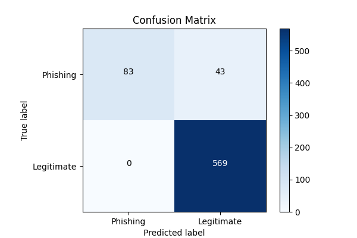

# 📧 MalGuard Classifier

A complete **Anamoly Detection** project using Hybrid approach **Rule Based + ML** to classify url as **Safe** or **Malicious**. The project includes **data preprocessing**, **Feature Engineering**, **training ML model**, **API development** and **Chrome Extension**.

---

## 📘 1. Project Overview

- Classifies URLs as Safe or Malicious.
- Preprocessing includes: Extracting various features from url.
- Train model - Isolation Forest.
- Provides visualizations: Confusion Matrix
- Deployable via **API and Extension** for interactive prediction.

---

---

## 🔄 2. Pipeline Workflow

1. **Load Dataset**
2. **Clean Text**
3. **Train Model** → `preprocessing/train.py`
4. **Evaluate Model** → `preprocessing/evaluate.py`
5. **Select Model & Save** → `models/model.pkl`
6. **Visualize Metrics** → Confusion Matrix
7. **Deploy with API and Chrome Extension**

---

---

## 📈 3. Evaluation Metrics & Graphs

Metrics calculated for test data:

- **Accuracy : 0.90**
- **Precision : 0.90**
- **Recall : 0.99**
- **F1 Score : 0.94**

**Visualizations Saved in `reports/plots/`:**

1. **Confusion Matrix**
<div align="center">
  
</div>

---

## 🛠️ 4. Installation

```bash
# Clone the repo
git clone https://github.com/roshan-acharya/SpamClassifier
cd MalGuard

# Create virtual environment (optional)
python -m venv venv
source venv/bin/activate  # Linux/macOS
venv\Scripts\activate     # Windows

# Install dependencies
pip install -r requirements.txt

```

## 🔄 5. Running the Project

- Run Training Pipeline

  ```bash
  python -m pipeline
  ```

- Run Flask App
  ```bash
  python -m Api.main
  ```

## 🧰 6. Tech Stack

- Python

- Pandas

- NumPy

- Scikit-learn

- Matplotlib, Seaborn

- Flask

- Pickle (for saving models)

## 👨‍💻 7. Author

**Roshan Acharya**  
_AI/ML Enthusiast_
