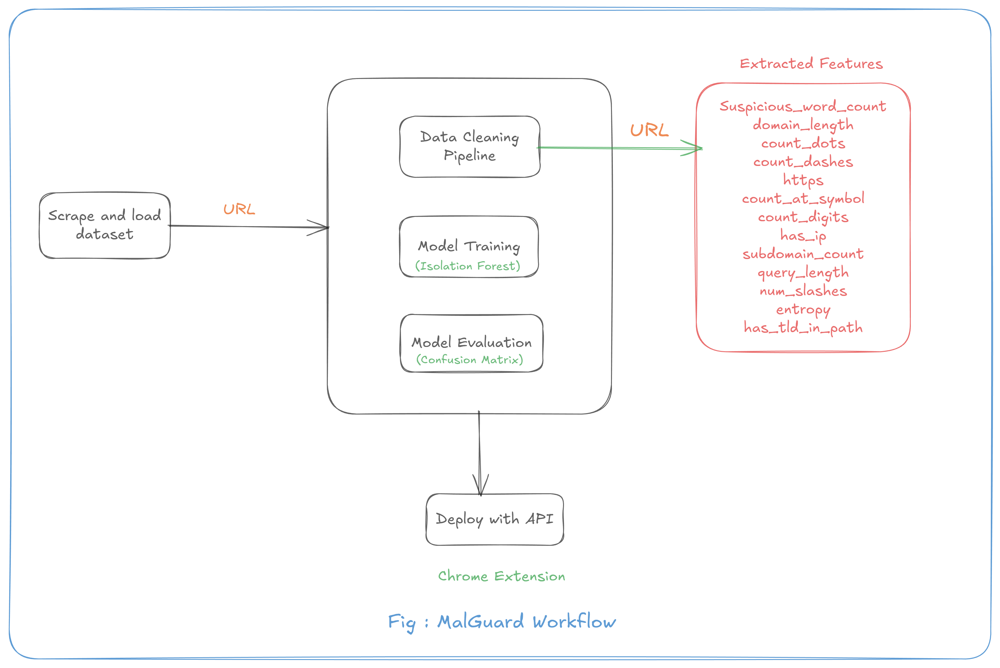

# 📧 MalGuard Classifier

A complete **Anamoly Detection** project using Hybrid approach **Rule Based + ML** to classify url as **Safe** or **Malicious**. The project includes **data preprocessing**, **Feature Engineering**, **training ML model**, **API development** and **Chrome Extension**.

It automatically flags malicious URLs and shows safe URLs with a ✅, providing users with a safer browsing experience.

---

## 📘 1. Project Overview

- Real-time phishing detection in Chrome

- Legitimate websites are marked safe

- Suspicious/phishing URLs are flagged automatically

- Hybrid model: Isolation Forest + Whitelist

- Confusion matrix & evaluation metrics included

---

---

## 🔄 2. Pipeline Workflow

1. **Load Dataset**
2. **Clean Text**
3. **Train Model** → `preprocessing/train.py`
4. **Evaluate Model** → `preprocessing/evaluate.py`
5. **Select Model & Save** → `models/model.pkl`
6. **Visualize Metrics** → Confusion Matrix
7. **Deploy with API and Chrome Extension**

---

<div align="center">
  
</div>

---

---

## 📦 Extension

## Install MalGuard (Developer Mode)

1. Download the extension from GitHub
2. Extract the folder
3. Open `chrome://extensions/`
4. Enable **Developer mode**
5. Click **Load unpacked** and select the MalGuard folder

MalGuard will start protecting you immediately.

## 🔌 API Integration

MalGuard communicates with a backend API for real-time predictions.

### Endpoint

```bash
GET https://malguard.onrender.com/predict?url=
<encoded_url>
```

### Sample Response

```json
{
  "prediction": "Malicious",
  "raw_value": -1,
  "url": "url"
}
```

---

## 📈 3. Evaluation Metrics & Graphs

Metrics calculated for test data:

| Metric        | Score |
| ------------- | ----- |
| **Accuracy**  | 0.90  |
| **Precision** | 0.90  |
| **Recall**    | 0.99  |
| **F1 Score**  | 0.94  |

**Class-wise performane**

| Class          | Precision | Recall | F1-score | Support |
| -------------- | --------- | ------ | -------- | ------- |
| -1 (Phishing)  | 1.00      | 0.66   | 0.79     | 126     |
| 1 (Legitimate) | 0.93      | 1.00   | 0.96     | 569     |

**Visualizations Saved in `reports/plots/`:**

1. **Confusion Matrix**
<div align="center">
  
</div>

---

## 🛠️ 4. Installation

```bash
# Clone the repo
git clone https://github.com/roshan-acharya/MalGuard.git
cd MalGuard

# Create virtual environment (optional)
python -m venv venv
source venv/bin/activate  # Linux/macOS
venv\Scripts\activate     # Windows

# Install dependencies
pip install -r requirements.txt

```

## 🔄 5. Running the Project

- Run Training Pipeline

  ```bash
  python -m pipeline
  ```

- Run Flask App
  ```bash
  python -m Api.main
  ```

## 🧰 6. Tech Stack

- Python

- Pandas

- NumPy

- Scikit-learn

- Matplotlib, Seaborn

- Flask

- Pickle (for saving models)

## 👨‍💻 7. Author

**Roshan Acharya**  
_AI/ML Enthusiast_
